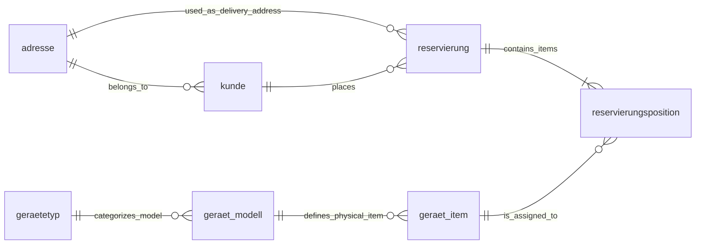

# SQL Reservierungssystem

> A robust relational database system designed for managing equipment rental processes, customers, and bookings.

## License

This project is licensed under the **GNU Affero General Public License v3.0 (AGPL-3.0)**.

I chose this license to ensure that this work remains open-source and free for the community.
If you use, modify, or distribute this code — including as a web service — you must:
1. Provide the same rights to others (Copyleft).
2. Disclose the source code.
3. Keep the original copyright notice.
4. If you run this software as a network service, you must make the source code available
   to the users of that service.

See the [LICENSE](LICENSE) file for the full legal text.

## How to Run

## Author

**mtdeve**
* [GitHub Profile](https://github.com/mtdeve)
* [Email](mailto:mirkotardio@web.de)

Feel free to contact me if you have any questions regarding this database schema!

## Documentation
* [Data Dictionary](docs/data_dictionary.md)
* [Architecture Decisions](docs/architecture.md)