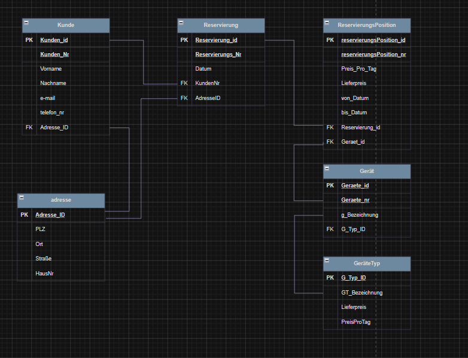

# Architectural Decisions - Reservierung DB

## 1. Overview

### Entity Relationship Diagram



### Data Model Hierarchy

```
geraetetyp  (Laptop — 25€/day)
└── geraet_modell  (MacBook Pro 14)
    └── geraet_item  (LT-001, SN-MAC-001)
        └── reservierungsposition  (01.05→05.05, 110€)
            └── reservierung  (RES-2026-001)
                └── adresse  (Lieferallee 55, Berlin)
```

---

## 2. Database Configuration & Project Structure

### Database Configuration

| Setting | Value | Reason |
|---|---|---|
| `SQL_MODE` | `NO_AUTO_VALUE_ON_ZERO` | Only NULL triggers AUTO_INCREMENT — inserting 0 keeps the value as-is |
| `time_zone` | `+00:00` (UTC) | Consistent timestamps across different server timezones and daylight saving changes |
| `character-set` | `utf8mb4` | Full Unicode support including emoji and special characters |

---

### Project Structure

    RESERVIERUNG_DB/
    ├── docs/
    │   ├── img/                            ← ERD and diagrams
    │   ├── architecture.md                 ← architectural decisions
    │   └── data_dictionary.md              ← technical reference
    │
    ├── migration/                          ← ordered migration scripts
    │   ├── 000_create_database.sql         ← database creation and configuration
    │   ├── 001_create_tables.sql           ← table structure and foreign keys
    │   ├── 002_add_constraints.sql         ← data integrity and indexes
    │   ├── 003_prozeduren.sql              ← stored procedures
    │   └── 004_functions.sql              ← reusable functions
    │
    ├── scripts/
    │   ├── Linux/                          ← planned: .sh equivalents
    │   ├── mysql_credentials.cnf           ← local only — gitignored
    │   ├── mysql_credentials.cnf.example   ← committed — setup template
    │   ├── run_db.bat                      ← full database setup
    │   └── run_res_test.bat                ← test runner
    │
    ├── sql/
    │   └── 100_seeds.sql                   ← reproducible test data
    │
    ├── tests/
    │   ├── _setup.sql                      ← session variables for all tests
    │   ├── 100_t_res_normale_buchung.sql
    │   ├── 101_t_res_overlap.sql
    │   ├── 102_t_res_defekt_wartung.sql
    │   ├── 103_t_res_kein_item.sql
    │   ├── 104_t_res_beamer_buchung.sql
    │   ├── 105_t_res_beamer_engpass.sql
    │   ├── 106_t_res_seed_overlap.sql
    │   ├── 107_t_res_adress_reuse.sql
    │   └── 108_t_res_zweiter_zeitraum.sql
    │
    ├── .gitignore
    ├── LICENSE                             ← GNU AGPL v3.0
    └── README.md

---

### Credentials Management

MySQL client configuration — never committed to version control.

| File | Committed | Purpose |
|---|---|---|
| `mysql_credentials.cnf` | NO — gitignored | Local credentials |
| `mysql_credentials.cnf.example` | YES | Setup template for new environments |

**Setup:**
1. Copy `mysql_credentials.cnf.example`
2. Rename to `mysql_credentials.cnf`
3. Insert password

**Why `.cnf` instead of inline credentials:** passwords passed as command-line arguments are visible in shell history. The `.cnf` file is read directly by the MySQL client library — the shell never sees the password and special characters (`<`, `>`, `@`) require no escaping.

---

### Scripts

**`run_db.bat`** — executes migration files in order

## 3. Data Model Decisions
   - Prices at geraetetyp level
   - Price snapshot in reservierungsposition
   - CHECK >= 0 instead of UNSIGNED for prices
   - VARCHAR for phone numbers and postal codes
   - DATE vs TIMESTAMP — von_datum/bis_datum vs datum

## 4. Availability Logic
   - item_zustand is logistic — not availability
   - Temporal availability via reservierungsposition dates
   - Overlap check logic explained

## 5. Concurrency & Integrity
   - Pessimistic locking — SELECT FOR UPDATE
   - Race condition scenario explained
   - DECLARE EXIT HANDLER — ROLLBACK + RESIGNAL
   - ACID principles applied

## 6. Address Management
   - Address deduplication strategy
   - NULL-safe operator <=>

## 7. Delete Strategy
   - ON DELETE RESTRICT — dove e perché
   - ON DELETE CASCADE — dove e perché

## 8. Roadmap
   - Migration to English planned
   - Views, Triggers, Access Control planned


## Decisions

### Prices live at `geraetetyp` level
All items of the same category share the same price. One update covers all models of that type.

### Price snapshot in `reservierungsposition`
`pos_preis_pro_tag` and `pos_lieferpreis` copy the price at booking time. If `geraetetyp` prices change later, historical reservations remain correct.

### `CHECK >= 0` instead of `UNSIGNED` for prices
`UNSIGNED` causes arithmetic underflow on subtraction and is MySQL-only (not standard SQL). `CHECK >= 0` is portable, explicit, and allows future discount/refund calculations.

### `item_zustand` is logistic — not availability
`item_zustand` represents the physical state for warehouse purposes. Temporal availability is determined by checking overlapping dates in `reservierungsposition` via `fn_ist_item_verfuegbar`. Both checks are combined.

### Pessimistic locking — `SELECT ... FOR UPDATE`
The availability check runs inside the transaction with `FOR UPDATE` to prevent race conditions. Two simultaneous users cannot book the same item.

### Address deduplication
`pro_adresse_suchen_oder_anlegen` reuses existing addresses instead of creating duplicates. Uses `<=>` NULL-safe operator for nullable `adresse_zusatz`.

### Composite UNIQUE on `reservierungsposition`
`(reservierung_id, reservierungsposition_nr)` prevents duplicate line numbers within the same reservation.

### ON DELETE CASCADE on `reservierungsposition`
Deleting a reservation automatically deletes all its positions. A position without a parent reservation has no meaning.

### ON DELETE RESTRICT everywhere else
Prevents accidental deletion of customers, devices or addresses while dependencies exist.

### Overlap check index
`idx_pos_zeitraum` on `(von_datum, bis_datum)` optimizes the availability query executed on every booking.

### UTC timestamp
`datum` in `reservierung` uses TIMESTAMP stored in UTC via `SET time_zone = '+00:00'`. Consistent behavior across different server timezones.

### Migration to English
Codebase currently in German. Full rename refactor to English planned in a dedicated commit before public release.