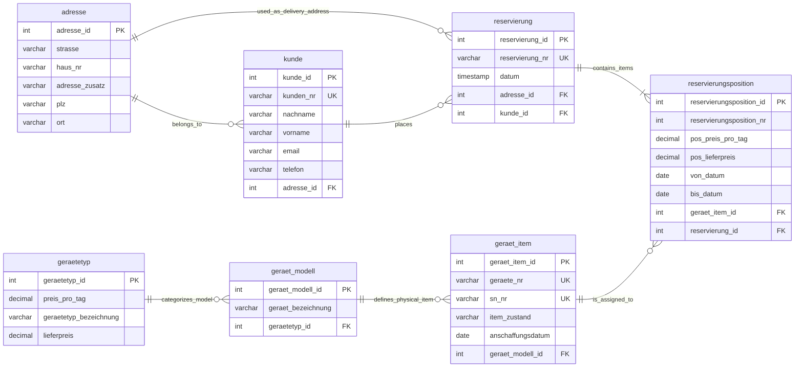

# Architectural Decisions - Reservierung DB

## 1. Overview

### Entity Relationship Diagram



### Data Model Hierarchy

```
geraetetyp  (Laptop — 25€/day)
└── geraet_modell  (MacBook Pro 14)
    └── geraet_item  (LT-001, SN-MAC-001)
        └── reservierungsposition  (01.05→05.05, 110€)
            └── reservierung  (RES-2026-001)
                └── adresse  (Lieferallee 55, Berlin)
```

---

## 2. Database Configuration & Project Structure

### Database Configuration

| Setting | Value | Reason |
|---|---|---|
| `SQL_MODE` | `NO_AUTO_VALUE_ON_ZERO` | Only NULL triggers AUTO_INCREMENT — inserting 0 keeps the value as-is |
| `time_zone` | `+00:00` (UTC) | Consistent timestamps across different server timezones and daylight saving changes |
| `character-set` | `utf8mb4` | Full Unicode support including emoji and special characters |

---

### Project Structure

    RESERVIERUNG_DB/
    ├── docs/
    │   ├── img/                            ← ERD and diagrams
    │   ├── architecture.md                 ← architectural decisions
    │   └── data_dictionary.md              ← technical reference
    │
    ├── migration/                          ← ordered migration scripts
    │   ├── 000_create_database.sql         ← database creation and configuration
    │   ├── 001_create_tables.sql           ← table structure and foreign keys
    │   ├── 002_add_constraints.sql         ← data integrity and indexes
    │   ├── 003_prozeduren.sql              ← stored procedures
    │   └── 004_functions.sql              ← reusable functions
    │
    ├── scripts/
    │   ├── Linux/                          ← planned: .sh equivalents
    │   ├── mysql_credentials.cnf           ← local only — gitignored
    │   ├── mysql_credentials.cnf.example   ← committed — setup template
    │   ├── run_db.bat                      ← full database setup
    │   └── run_res_test.bat                ← test runner
    │
    ├── sql/
    │   └── 100_seeds.sql                   ← reproducible test data
    │
    ├── tests/
    │   ├── _setup.sql                      ← session variables for all tests
    │   ├── 100_t_res_normale_buchung.sql
    │   ├── 101_t_res_overlap.sql
    │   ├── 102_t_res_defekt_wartung.sql
    │   ├── 103_t_res_kein_item.sql
    │   ├── 104_t_res_beamer_buchung.sql
    │   ├── 105_t_res_beamer_engpass.sql
    │   ├── 106_t_res_seed_overlap.sql
    │   ├── 107_t_res_adress_reuse.sql
    │   └── 108_t_res_zweiter_zeitraum.sql
    │
    ├── .gitignore
    ├── LICENSE                             ← GNU AGPL v3.0
    └── README.md

---

### Credentials Management

MySQL client configuration — never committed to version control.

| File | Committed | Purpose |
|---|---|---|
| `mysql_credentials.cnf` | NO — gitignored | Local credentials |
| `mysql_credentials.cnf.example` | YES | Setup template for new environments |

**Setup:**
1. Copy `mysql_credentials.cnf.example`
2. Rename to `mysql_credentials.cnf`
3. Insert password

**Why `.cnf` instead of inline credentials:** passwords passed as command-line arguments are visible in shell history. The `.cnf` file is read directly by the MySQL client library — the shell never sees the password and special characters (`<`, `>`, `@`) require no escaping.

---

### Scripts

**`run_db.bat`** — executes migration files in order, optionally imports seeds.

**`run_res_test.bat`** — test runner with two modes:

| Mode | Behavior |
|---|---|
| `run_success` | Test must complete without error |
| `run_expected_fail` | Test must raise SIGNAL 45000 |

Each test is concatenated with `_setup.sql` via `type file1 file2 | mysql` to share session variables in a single connection.

---

### Seeds & Test Naming Convention

**`100_seeds.sql`** — reproducible dataset covering all test scenarios. All values carry `_test` suffix to distinguish from production data.

**Test files** follow this convention:

    {order}_{type}_{domain}_{scenario}.sql

    100_t_res_normale_buchung.sql
    │   │   │   └── scenario
    │   │   └── domain (res = reservierung)
    │   └── type (t = test)
    └── execution order — grouped by hundreds

## 3. Data Model Decisions

### Prices at `geraetetyp` Level
Prices live at category level — not on individual models or items.
One price update covers all models and items of that category automatically.

### Price Snapshot in `reservierungsposition`
`pos_preis_pro_tag` and `pos_lieferpreis` copy the current price at booking time.
If `geraetetyp` prices change later, historical reservations remain correct.

### `CHECK >= 0` instead of `UNSIGNED` for Prices
- Arithmetic underflow on subtraction — problematic for future discount and refund calculations
- MySQL-only syntax — not portable to other RDBMS
- `CHECK >= 0` is explicit, standard SQL, and portable

### `DATE` vs `TIMESTAMP`

| Field | Type | Reason |
|---|---|---|
| `von_datum`, `bis_datum` | DATE | Absolute calendar days — no timezone conversion needed |
| `datum` | TIMESTAMP | Creation moment — stored in UTC, converted by application layer |

### Business Key vs Technical Key

| Key | Example | Purpose |
|---|---|---|
| Technical (`_id`) | `kunde_id` | Internal joins and foreign keys |
| Business (`_nr`) | `kunden_nr` | External reference e.g. 'K-001' |

Business keys are `VARCHAR` — alphanumeric codes.
Technical keys are `INT AUTO_INCREMENT` — pure internal identifiers.

### `reservierungsposition_nr` is `INT` — not `VARCHAR`
All other `_nr` fields are `VARCHAR` business codes.
`reservierungsposition_nr` is a sequential line number — purely numeric, validated with `CHECK > 0`.

## 4. Availability Logic

### `item_zustand` is Logistic — Not Availability
`item_zustand` represents the current physical state of a device for warehouse purposes.
It is not the source of truth for temporal availability.

| Value | Meaning |
|---|---|
| `verfügbar` | Physically in warehouse |
| `vermietet` | Currently out on rental |
| `defekt` | Broken — permanently excluded |
| `wartung` | Under maintenance — temporarily excluded |

### Why `item_zustand` Alone Is Not Enough
`item_zustand` is set to `vermietet` at booking time — not at physical delivery.
This means a device booked for May 1st shows `vermietet` from the moment of booking,
blocking a second user from booking the same device for June — even though it is physically free.

### Temporal Availability via `reservierungsposition`
Real availability is determined by checking overlapping date ranges in `reservierungsposition`.
Both checks are always combined:

    item_zustand NOT IN ('defekt', 'wartung')   ← physical state
    AND no overlapping reservation in dates      ← temporal state

### Overlap Logic
Two periods overlap when:

    existing.von_datum <= requested.bis_datum
    AND existing.bis_datum >= requested.von_datum

Visually:

    Existing:      |------A------|
    Conflict:            |------B------|
    No conflict:                        |--C--|

## 5. Concurrency & Integrity

### Pessimistic Locking — `SELECT ... FOR UPDATE`
The availability check runs inside the transaction with `FOR UPDATE`.
MySQL places an exclusive lock on the selected row until the transaction ends.

Without locking:

    User A reads LT-001 → verfügbar  ✓
    User B reads LT-001 → verfügbar  ✓  (no lock — reads freely)
    User A books LT-001 → vermietet
    User B books LT-001 → vermietet  ← same item booked twice

With `FOR UPDATE`:

    User A reads + locks LT-001
    User B attempts to read → WAIT...
    User A commits → LT-001 is now booked
    User B unblocked → no item available → SIGNAL 45000

When multiple items are available, the second user receives the next free item
without waiting — the lock only applies to the specific row being read.

---

### ACID Principles Applied

| Principle | Implementation |
|---|---|
| **Atomicity** | `START TRANSACTION` / `COMMIT` / `ROLLBACK` — all or nothing |
| **Consistency** | `CHECK`, `FOREIGN KEY`, `UNIQUE` constraints — rules always enforced |
| **Isolation** | `SELECT ... FOR UPDATE` — transaction works on locked data |
| **Durability** | `COMMIT` — data is permanent after confirmation |

---

### `DECLARE EXIT HANDLER FOR SQLEXCEPTION`
Automatic error handling inside procedures.

    Any SQL error occurs
        → EXIT: stop execution immediately
        → ROLLBACK: undo all writes in current transaction
        → RESIGNAL: forward original error to the caller

Without this handler, an error mid-transaction would leave the database
in an inconsistent state — e.g. a reservation created without its position.

---

### `SIGNAL SQLSTATE '45000'`
Custom application error. `45000` is reserved by MySQL for user-defined errors —
it never conflicts with system error codes.
Used when business logic conditions are not met — e.g. no available item found.

## 6. Address Management

### Address Deduplication
Addresses are shared across entities — never duplicated.
The same address can be referenced by multiple customers and multiple reservations.

`pro_adresse_suchen_oder_anlegen` handles this automatically:

    Input: street, house number, addition, postal code, city
        → Search for exact match in adresse table
        → Found: return existing adresse_id
        → Not found: insert new record, return new adresse_id

---

### NULL-Safe Comparison — `<=>`
`adresse_zusatz` is nullable — standard `=` fails with NULL:

    NULL =   NULL  → NULL   (always fails)
    NULL <=> NULL  → TRUE   (correct)

The `<=>` operator ensures two addresses with no addition
are correctly recognized as the same address.

---

### Delivery Address vs Customer Address
A reservation's delivery address is independent from the customer's address.
Both reference `adresse.adresse_id` but through different foreign keys:

| FK | Table | Purpose |
|---|---|---|
| `fk_kunde_adresse` | `kunde` | Customer's home address |
| `fk_res_adresse` | `reservierung` | Delivery address for this reservation |

A customer can request delivery to any address —
not necessarily their registered address.

## 7. Delete Strategy

### ON DELETE RESTRICT
Prevents deletion of a record while dependent records exist.
Applied everywhere except `reservierungsposition`.

| FK | Protected Relationship |
|---|---|
| `fk_kunde_adresse` | Address cannot be deleted while customers reference it |
| `fk_modell_typ` | Device type cannot be deleted while models reference it |
| `fk_item_modell` | Model cannot be deleted while items reference it |
| `fk_res_adresse` | Address cannot be deleted while reservations reference it |
| `fk_res_kunde` | Customer cannot be deleted while reservations exist |
| `fk_respos_item` | Device item cannot be deleted while positions reference it |

---

### ON DELETE CASCADE
Applied only to `fk_respos_res` — reservation → position relationship.

    DELETE reservierung
        → automatically deletes all reservierungsposition rows

A reservation position has no meaning without its parent reservation.
Cascade ensures no orphaned positions remain in the database.

---

### Why Not CASCADE Everywhere
Cascading deletes propagate silently through the database.
Deleting a customer could silently delete all their reservations and positions.
RESTRICT forces explicit handling — the application must decide
what to do with dependent data before deletion is allowed.

## 8. Roadmap

### Completed
| File | Description |
|---|---|
| `000_create_database.sql` | Database creation and configuration |
| `001_create_tables.sql` | Table structure and foreign keys |
| `002_add_constraints.sql` | Data integrity checks and indexes |
| `003_prozeduren.sql` | Stored procedures for business logic |
| `004_functions.sql` | Reusable functions for calculations |
| `005_views.sql` | Availability calendar and revenue reporting |

---

### In Progress
| File | Description |
|---|---|
| `006_triggers.sql` | Automated validation and audit logging |
| `007_access_control.sql` | RBAC — roles and permissions |

---

### Future Direction
| Topic | Description |
|---|---|
| English refactor | Full rename of all database objects to English in a dedicated commit |
| Linux scripts | `.sh` equivalents of `.bat` scripts in `scripts/Linux/` |
| Backend | REST API layer on top of the database |
| Frontend | Availability calendar UI based on `fn_ist_item_verfuegbar` |
| Documentation | Migrate to dbdocs.io or SchemaSpy for auto-generated database documentation |

